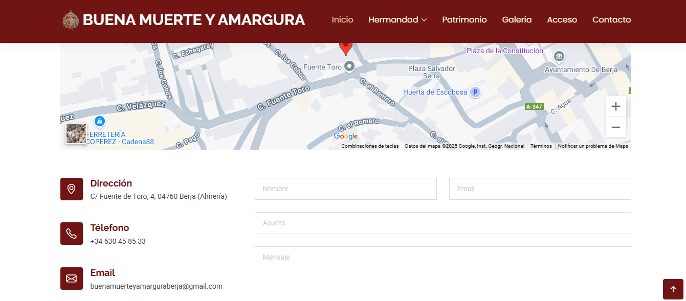

# MANUAL USUARIO  
**WEB COFRADÍA BUENA MUERTE**  

**Autor:** Lidia Lopez Martin  
**Versión:** 1.0  
**Fecha:** 16/06/2025  

---

## ÍNDICE

1. [Introducción](#introducción)  
2. [Requisitos del sistema](#requisitos-del-sistema)  
3. [Acceso a la aplicación](#acceso-a-la-aplicación)  
4. [Navegación general](#navegación-general)  
5. [Descripción de las diversas partes de la web](#descripción-de-las-diversas-partes-de-la-web)  
   - [Hermandad](#hermandad)  
   - [Patrimonio](#patrimonio)  
   - [Galería](#galería)  
   - [Acceso](#acceso)  
   - [Contacto](#contacto)  

---

## Introducción

Esta web permite a los visitantes conocer la historia, los componentes, el patrimonio y actividades que forman parte de la Cofradía del Cristo de la Buena Muerte y María Santísima de la Amargura.  
Asimismo, permite registrarse o bien acceder al perfil de usuario ya registrado. También es posible contactar con la cofradía a través de un formulario de contacto.

---

## Requisitos del sistema

- Navegador Web (Firefox, Chrome, Edge, etc.)  
- Conexión a Internet  
- Resolución de pantalla recomendada: 1280 x 720 o superior  

---

## Acceso a la aplicación

Para acceder a la aplicación, lo haremos mediante la siguiente URL:  
`http://localhost:8080/`  
*Nota: En un principio no se dispone de un dominio propio.*

---

## Navegación general

Desde el menú de navegación se podrá acceder a:

- **HERMANDAD** (historia y miembros de la hermandad)  
- **PATRIMONIO** (bienes materiales que posee la hermandad)  
- **GALERÍA** (muestra de imágenes de la hermandad)  
- **ACCESO** (acceso de hermanos registrados y registro de nuevos hermanos)  
- **CONTACTO** (localización y formas de contacto con la hermandad)

---

## Descripción de las diversas partes de la web

### HERMANDAD

- **Historia:** Breve historia de la Hermandad  
- **Colectivos:** Distintos colectivos que forman la Hermandad  
- **Junta de Gobierno:** Breve descripción, con imagen  
- **Grupo Joven:** Breve descripción, con imagen  
- **Costaleros:** Breve descripción, con imagen  

---

### PATRIMONIO

Se muestran fotos y breves explicaciones del patrimonio que posee la Hermandad.

---

### GALERÍA

Se mostrarán 8 fotos, que se podrán seleccionar para ver en mayor tamaño.

---

### ACCESO

#### Hermanos ya registrados

Se deberá introducir el **email** y la **contraseña**.  
Según el tipo de Hermano, se mostrarán diferentes avisos.

**En “Mi Perfil”:**

- Si el hermano es **costalero, nazareno, mantilla u otro**:  
  - Se mostrarán los datos personales.  
  - Podrá **modificar** o **borrar** su información.

- Si el hermano es **administrador o miembro de la Junta**:  
  - Verá dos secciones:

    **Mis Datos:**  
    - Se muestran los datos personales, con opción de modificar o borrar.  

    **Datos Hermanos:**  
    - Tabla con los datos de todos los hermanos.  
    - El campo contraseña estará bloqueado.

    **Administrador:**  
    - Podrá insertar, modificar, borrar o filtrar (por nombre o tipo).  

    **Junta:**  
    - Podrá modificar, borrar o filtrar.

#### Registrarse

Los hermanos se registrarán eligiendo el tipo de hermano.  
*Los tipos “administrador” y “junta” solo podrán ser añadidos por el administrador.*  
Opciones disponibles: **costalero, nazareno, mantilla, otros**

---

### CONTACTO

- Mapa de localización de la casa de hermandad  
- Dirección postal  
- Teléfono  
- Email de contacto  
- Formulario para enviar mensajes  

---