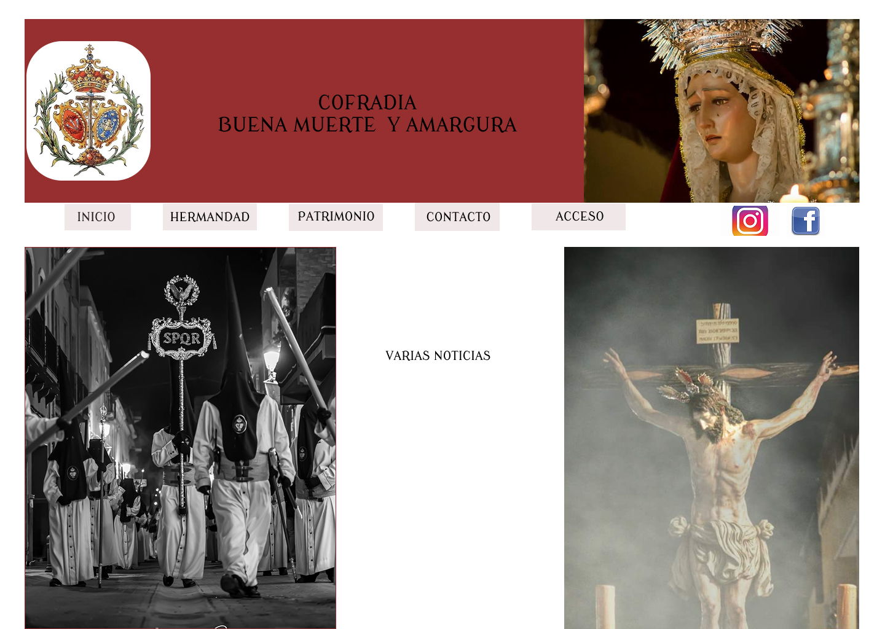

# Proyecto Fin de Ciclo: Sitio Web para la Cofradía "Buena Muerte y Amargura"

## Descripción General

Mi proyecto fin de ciclo se basa en la implementación de un sitio web para una Cofradía de Semana Santa. El propósito principal es ofrecer una plataforma informativa y funcional para miembros actuales, futuros hermanos y administradores de la Cofradía.

## Funcionalidades Principales

- **Información sobre la Cofradía**:
  - Historia
  - Componentes
  - Patrimonio
  - Noticias de actualidad

- **Zona de Contacto**:
  - Formulario de contacto
  - Mapa de localización

- **Zona de Acceso**:
  - Para Hermanos y futuros Hermanos
  - Para el administrador del sitio web

## Tecnologías Utilizadas

### Frontend

- HTML
- CSS
- Bootstrap
- JavaScript

### Backend

- PHP

### Base de Datos

- MySQL

### Otras Tecnologías

- GitHub (control de versiones)
- Docker (contenedorización del proyecto)

## Vista Previa del Diseño

A continuación, se muestra una primera aproximación a la pantalla de inicio del sitio web:

Esta vista puede estar sujeta a cambios durante el desarrollo.
